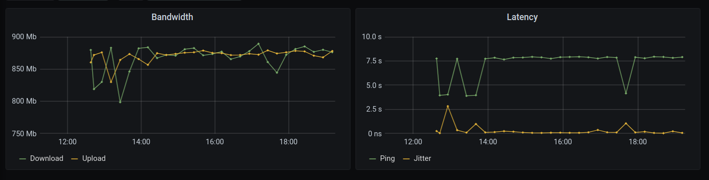

# ookla-influx-grafana
Use the OOKLA speedtest CLI tool, send data into influxdb and plot in Grafana

## Summary

If you already have a monitoring configuration using collectd, influxdb
and grafana (a common stack; see, for example [my setup](https://www.sweharris.org/post/2017-09-03-router-graphs/) then this script can use the
[Ookla CLI tools](https://www.speedtest.net/apps/cli) and throw additional
data in.

Once the data is in influxdb then you can build a dashboard to draw the
graphs.

## Setup.

Install the [CLI tool](https://www.speedtest.net/apps/cli) for your OS.

Verify it works with the new `speedtest` command.  e.g. from my home
connection:

    % speedtest                 
    
       Speedtest by Ookla
    
         Server: Green House Data - Orangeburg, NY (id = 13669)
            ISP: Verizon Fios
        Latency:     7.61 ms   (0.41 ms jitter)
       Download:   866.69 Mbps (data used: 996.4 MB)                               
         Upload:   311.21 Mbps (data used: 231.1 MB)                               
    Packet Loss: Not available.
     Result URL: https://www.speedtest.net/result/c/4c9ef9d6-6245-4df1-a898-9f2b99203b60
    
Now you can see what servers are close to you easily.

    % speedtest -L
    Closest servers:
    
        ID  Name                           Location             Country
    ==============================================================================
     22774  DediPath                       Secaucus , NJ        United States
     32494  Rackdog                        Secaucus, NJ         United States
       982  Interserver, inc               Secaucus, NJ         United States
     13669  Green House Data               Orangeburg, NY       United States
     15784  Sprint                         Harrison, NJ         United States
     14854  QTS Data Centers               Jersey City, NJ      United States
     17545  Planet Networks                Parsippany, NJ       US
     13098  Pilot                          New York, NY         United States
     16976  Spectrum                       New York, NY         United States
     10546  Sprint                         New York, NY         United States

These are the same servers that show on the [speedtest.net](https://speedtest.net) site, so you can test and see which one gives you the results you like.

Now edit the `ookla-test` script and put in the serverID you picked.  You
should also enter the hostname of your `influxDB` server and the database
you want to write data to.

## Run the script

    % ./ookla-test

This should return without error.  In your influxdb you should now see
a new measurement `speedtest`

    % influxdb
    > use collectd
    > show series from speedtest
    key
    ---
    speedtest,host=YOURHOSTNAME

    > select * from speedtest
    name: speedtest
    time                down      host         jitter ping  up
    ----                ----      ----         ------ ----  --
    1595781450000000000 109955294 YOURHOSTNAME 0.259  7.757 107548949

The "down" and "up" values are in bytes.  If you do a "*8/1000000" on
this number then you'll get a value that matches what would show on
the web site.  We'll do this in the Grafana section.

At this point you should set up a cron job to run this on a regular
basis.

## Grafana

The `grafana.json` file describes the dashboard I created.  It has two panels;
the left shows bandwidth and draws the up/down lines.  The right panel shows
ping times and jitter.

